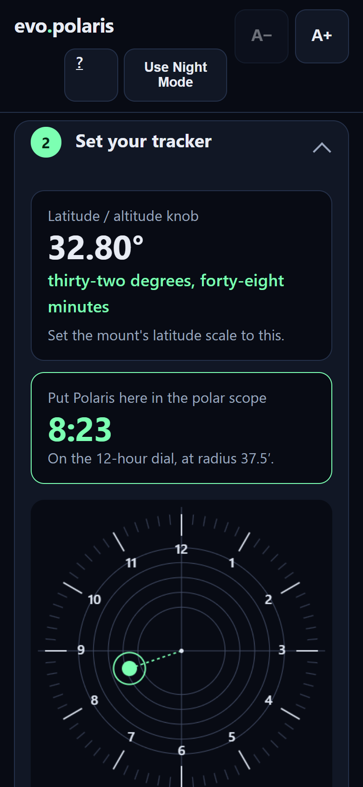
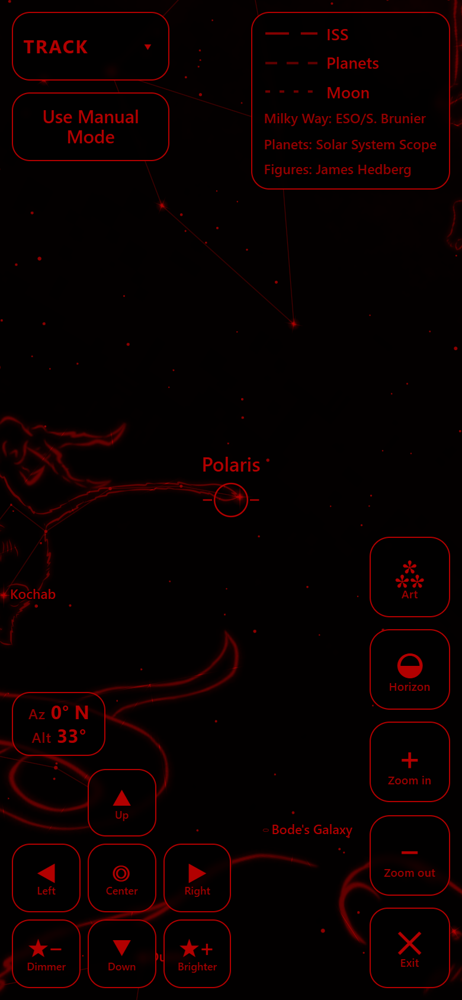
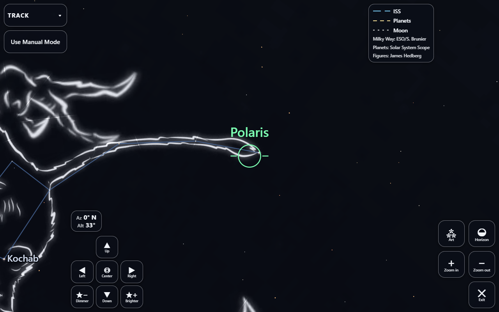

# evo.polaris

Free, open-source night-sky guide and polar-alignment app.
**One tap finds Polaris, the ISS, the planets, constellations and galaxies**,
and it gives you the numbers to align a star tracker or equatorial mount.
**Made for every astronomer**, including astronomers with physical
disabilities, limited fine motor control or low vision — by a disabled
astronomer.

It started as a way to find Polaris and has grown into a guide to the whole
night sky: **the International Space Station**, **the planets**,
**the Moon and the Sun**, **28 constellations** and
**the fifteen brightest galaxies**, with the Milky Way drawn behind them.

It is built for people with **physical disabilities**,
**limited fine motor control** (a tremor, a weak grip, hands that can't land on
a small target) and **low vision**: astronomers who can't crouch behind an
eyepiece, hold a phone steady, or work a fiddly touch target in the dark.
Everyone else gets an app that is simply easier to use at night.

Many apps for this job cost money, and most assume a body that cooperates.
This one is free and works offline, and:

- **reads its numbers out loud**, and writes each one out in words as well as
  digits;
- **works entirely by single taps**: you can drag the sky, or hold an arrow
  to keep it moving, but the buttons do everything those do, and nothing needs
  a pinch or a double-tap;
- **keeps its large buttons where they are**, so nothing moves under your
  finger;
- **scales its text up to 1.6×**, in high-contrast colours, with a pure-red
  Night Mode that keeps your eyes dark-adapted.






## What it tells you

Give it your position and it produces the three numbers you actually dial into
a mount:

| Number | What it is |
| --- | --- |
| **Latitude / altitude knob** | Your latitude. Sets the RA axis parallel to the Earth's. |
| **Compass bearing for true north** | Magnetic declination is corrected on-device, so the azimuth you set is true north and not magnetic north. |
| **Polaris on the reticle** | Clock position and radius on the 12-hour iOptron AccuAlign dial, drawn as well as written. |

## Finding things in the sky

The sky view is a live chart of the sky above you tonight, and its **Track**
menu points you at something with one tap:

- **Polaris**, with the Big Dipper star-hop drawn to it (the Southern Cross in
  the south).
- **The International Space Station**, where it is right now, with its path
  across your sky. This is the one part of the app that needs the internet; it
  asks a free tracker, and everything else is worked out on your phone.
- **The Moon** and **the Sun**.
- **The planets**: one button, tapped again and again, walks outward from the
  Sun, Mercury first and Pluto last.
- **28 constellations**, the same way, each drawn as a stick figure, with
  James Hedberg's artwork behind it if you want it.
- **The fifteen brightest galaxies**, brightest first, each drawn at its true
  size, the Andromeda Galaxy three degrees across.

A switch skips planets and constellations that are below the horizon. With the
compass on, arrows tell you which way to turn. Without it, Manual Mode moves
the view with Up, Down, Left and Right buttons, so you never have to hold the
phone up to the sky. The stars can be made brighter or dimmer, and the whole
view goes full screen.

## Both hemispheres

The app follows the sign of your latitude, and the south is not simply the
north with a sign flipped:

- **There is no southern Polaris.** Sigma Octantis is magnitude 5.5 — below
  naked-eye visibility except under dark skies. The app says so instead of
  offering it as an equivalent, and points you at the Southern Cross: run its
  long axis about 4.5 times its own length. The Pointers' perpendicular
  bisector is drawn too, crossing that line at the pole to confirm it.
- **The reticle circles differ** — 36'–44' for Polaris, 60'–70' for Sigma
  Octantis — and the drawn scale follows the scope you are looking through.
- **The dial counts the other way**, because the sky turns the opposite way
  about the southern pole.
- **The chart's handedness flips**, since facing south puts east on your left.
- **A southern mount points at true south**, so its compass bearing is 180°
  from the northern answer.

## Finding true north without a compass

A desktop browser has no magnetometer, and plenty of phones have a bad one, so
the app never assumes you have a working compass. It offers three routes:

- **Polaris itself.** Polaris sits about 0.6° from the true pole, so pointing at
  it *is* pointing true north. People assume they need north in order to find
  Polaris; it works the other way round — star-hop to it from the Big Dipper
  using the chart and you are aligned, with no compass and no declination
  correction anywhere in the loop.
- **A shadow at solar noon.** The app computes the exact moment the Sun crosses
  your meridian. At that instant any vertical object's shadow lies on the true
  north–south line. No instrument at all. Which way the shadow points is read
  off the computed Sun position rather than assumed from hemisphere, because
  inside the tropics the Sun passes north of the zenith for part of the year and
  the shadow flips with it.
- **A magnetic compass**, with the declination already worked out for you.

Solar-noon time is shown in your *device's* timezone and labelled with it, since
that is the useful clock when you are standing at the coordinates.

## Running it as a website

It is a plain static site — no build step, no server-side anything — so it can
be dropped on any static host, and you can type your position in by hand instead
of using GPS.

One requirement: **serve it over HTTPS.** Geolocation, the device-orientation
compass, and the service worker that makes it work offline are all
secure-context APIs. Over plain `http://` they fail silently and the GPS button
appears to do nothing. `localhost` is exempt, which is why `npm run serve` works.

### The one network call

Typing coordinates in by hand leaves altitude to find, so there is a button that
looks it up from [Open-Meteo](https://open-meteo.com/) — no key, no account.

It is a button and not an automatic lookup because it is the only request that
leaves **your coordinates with someone else**. That should be a thing you
choose, not a thing that happens.

The app makes one other request, and it is a different kind of thing. When you
leave the page it reports **how many seconds you were here** to this site's own
server — a single integer, no identifier, no cookie, nothing written to
storage, no coordinates, and nothing to a third party. The server already knows
your address and browser from having served you the page; this adds one number
to that and stops.

It exists because polaris is a single page: everything else in the access log
arrives while the page loads, so nothing in it can say whether the app was used
for ten seconds or an hour. That is worth knowing and there was no honest way
to infer it.

It does not run at all if your browser sends **Do Not Track** or **Global
Privacy Control**, and it never runs offline — the send fails and the app
carries on without noticing. Visits shorter than ten seconds are not reported.
The code is `site/src/dwell.js`; it is about sixty lines and says exactly what
it sends.

It is also honestly a convenience rather than an accuracy fix: altitude shifts
magnetic declination by **under 0.01° even at 3000 m**, against a good polar
alignment of about 0.1°. Leaving it at sea level costs you nothing. The reason
it is worth having is that nobody should have to go and look up their own
elevation and type it in.

### Deploying

The service worker uses **network-first for the app shell** and cache-first only
for the bundled star and magnetic data. Cache-first for everything is how a
static site pins every returning visitor to the first build they ever loaded, so
a deploy would reach nobody until they cleared site data. Move `VERSION` in
`sw.js` whenever a precached file changes, then run `npm run precache-stamp`;
old caches are dropped on activate. `test/precache-version.test.mjs` fails if a
precached file changed and the key did not. The release stamp itself
(`build-version.json`, `src/version.js`) is exempt, so a release on its own
never needs a new key.

### The link-preview card

`site/og-card.png` is what LinkedIn, Slack and X render when the link is
shared. It is **generated, not hand-made** — the previous card was a JPEG
committed with nothing behind it, so it could only be re-encoded, never
rebuilt, and its chart was the 420px on-screen canvas scaled *up*.

It is rendered by this repo's own generator:

```
python scripts/make_og_card.py
```

The fleet has a shared generator at `evo.scripts\make_og_card.py` and most
sites should use it. This one does not, for the reason that file's header gives
for evo.ehs: a card built around a product image is a different layout and
belongs with the image it depends on. The shared layout reserves `w - 400` for
text and insets the shot beside it, which suits a card whose picture is
supporting evidence — here the picture *is* the product, and the leftover
column made it smaller than in any earlier version.

The chart is drawn from `site/src/data/stars.json` — the same catalogue the app ships — at three times final size and downsampled once, so the stars resolve as points rather than aliased squares. There is no screenshot step and nothing to capture by hand.

Two things to get right when regenerating it:

- **Render the chart at a northern latitude.** The card says *find Polaris*,
  and Polaris is not visible from the southern hemisphere. A southern chart
  contradicts the words beside it, which shipped once.
- **Bump the `?v=` on `og:image` whenever the card changes.** LinkedIn and X
  cache the image against its URL, separately from the page metadata. Clicking
  Inspect re-reads the tags but still serves the picture they already hold, so
  replacing `og-card.png` in place changes nothing they show — this was watched
  happen. The query string makes it a URL they have not seen. Then re-scrape.

PNG, not JPEG: the card is flat colour and text on a dark ground, which is what
PNG keeps sharp and what JPEG's chroma subsampling smears.

## Accessibility

This is the point of the project, not a later pass.

- **Single taps reach everything.** Dragging the sky and holding an arrow are
  shortcuts, never the only way: the arrow buttons go everywhere a drag goes.
  Nothing needs a pinch or a double-tap.
- **Targets stay put.** Values update in place; nothing reflows under your
  finger, because re-acquiring a moved target is expensive.
- **Text scales** through five sizes, from normal to 1.6×, with two big buttons
  that never move, and the choice sticks.
- **Turns with the phone.** The installed app is not locked to portrait, so a
  phone in a fixed landscape mount works too (WCAG 1.3.4), and full screen lays
  itself out side by side when there is width and no height.
- **Red night mode**, because an app that ruins your dark adaptation is an app
  you can't use twice in one night.
- **Reads out loud** via the browser's speech synthesis, for when you are at the
  mount and not at the screen.
- **Haptic confirmation** when you are pointing at Polaris.
- **Every graphic has a text equivalent.** The numbers are the interface; the
  reticle and chart are support. Nothing requires reading a picture.
- **Manual position entry** for when GPS won't play, and fields keep their
  values when an entry is rejected.
- **WCAG Mode**, one press away under A− / A+: a version of the app built to
  meet WCAG 2.2 Level AA. See below.

## WCAG 2.2 conformance

**WCAG Mode** is a separate option, switched on with the **Use WCAG Mode**
button under A− / A+. Once it is on, the same button reads **Exit WCAG Mode**.
It is remembered between visits and changes nothing about the default mode.
It is built to meet **WCAG 2.2 Level AA** and adds:

- **Focus that is never hidden** (2.4.11). A control that takes keyboard focus
  is scrolled clear of the pinned header.
- **A full screen that never covers its controls** (2.4.11). The key folds
  behind a **Show the Key** button. The photo credits stay on screen, as their
  licence requires, at a fixed size so larger text cannot push them into the
  buttons.
- **Track labels that wrap instead of being cut off** (1.4.4, 1.4.10).
- **Errors tied to their field** (3.3.1). A rejected latitude or longitude box
  is marked invalid, linked to the message that explains it, and given focus.
- **Links underlined** (1.4.1), and **photo credits at full strength** so they
  stay readable in Night Mode (1.4.3).

Beyond AA, Dark Mode keeps all text at 7:1 contrast or better (AAA, 1.4.6) and
every control at least 44px (AAA, 2.5.5), in both modes. Night Mode's pure red
on black reaches 5.25:1: AA, not AAA, because anything brighter would cost the
dark adaptation it exists to protect.

**How it was checked,** on 2026-10-07:
- axe-core 4.10 found no WCAG A or AA violations in WCAG Mode, in Dark Mode or
  Night Mode, with every key row and photo credit on screen;
- each A and AA criterion was reviewed by hand;
- the page reflows at 320px wide at the largest text size and under WCAG's
  text-spacing overrides;
- the full-screen layout was measured at 320×568, 375×667, 390×844 and 667×375
  at all five text sizes.

**Known limits.** On the smallest phones (320×568), and on phones held
sideways, at the app's three largest text sizes, the folded key's photo credits
still touch the Art button or the Az/Alt readout in full screen. WCAG's resize
tests use browser zoom, which stays clear. Screen-reader testing on real
devices (VoiceOver, TalkBack) has not been done yet.

## Accuracy, and how it is checked

Astronomy code is easy to get subtly, confidently wrong, so the two pieces of
real maths are validated against published sources rather than against
themselves. `npm test` runs both.

- **Magnetic declination** is a degree-12 spherical harmonic synthesis of
  WMM2025, checked against all 100 of NOAA's own published test values. It
  agrees to **better than 0.01°** in declination and **1 nT** per component.
- **Polaris' position** is proper motion plus IAU-1976 precession on a
  Hipparcos J2000 position. Sidereal time is anchored to the textbook GMST at
  J2000. Against the worked example published in iOptron's own SkyTracker Pro
  manual, the radius agrees to **0.3′** and the dial position to about **2.4°**
  — roughly 1.6′ of alignment error.

  That last residual is not yet explained. It is most likely that the manual's
  figure was read off a screenshot taken a few minutes from the timestamp it
  quotes (2.4° is 9.5 minutes of clock), or that iOptron apply a refraction
  correction we don't. **In practice it is small:** 1.6′ of polar error lets a
  star drift by at most about 0.4″ a minute. If you need alignment to better
  than a few arcminutes, treat about 2.4° as the dial position's known limit.

Two traps are locked down by tests because both produce output that still looks
correct:

- The AccuAlign reticle is a **12-hour dial spanning a full circle**, so one
  dial hour is 30°, not 15°. Mapping hour-angle hours straight onto dial hours
  is a silent factor-of-two error. (It is also why iOptron tell Takahashi users
  to halve their 24-hour reading.)
- The sky chart is drawn **facing north**, so west is on the left. A mirrored or
  180°-rotated chart still looks like a star chart and will send you
  star-hopping the wrong way.

## Which mounts this helps

It computes numbers, so it helps with any polar-aligned mount. It is written
against the iOptron AccuAlign reticle specifically.

Worth knowing if you own an iOptron tracker: the **SkyTracker** and **SkyTracker
Pro** have no data port at all — the micro-USB is charge-only, and their manual
lists only a power switch, a rate switch and a N/S switch. No app can control
them. The **SkyGuider Pro** adds an ST-4 guide port and an HBX hand-controller
port; the **SkyHunter** speaks iOptron's V3 protocol over WiFi and can be driven
properly. This app deliberately does the part that works for all of them.

## Running it

```bash
npm test          # validate the maths
npm run serve     # http://localhost:8790
```

The same suite runs on GitHub for every pull request and every push to `main`.

To regenerate the bundled data from its public sources:

```bash
bash scripts/fetch-sources.sh && npm run build-data
```

The app is a plain PWA — no build step, no framework, no dependencies. It works
offline once loaded, which is the normal case in a dark field.

### Installing it

The same app installs on Android, iPhone and desktop — one set of files, no
store. On Android, Chrome offers **Install app**. On an iPhone, open it in
Safari, then **Share → Add to Home Screen**. Installed, it opens in its own
window with no browser bar and keeps working with no signal.

The iPhone icon and the install sheet's screenshots are pictures of the app,
drawn from it:

```bash
npm run serve        # in one terminal
npm run pwa-images   # in another; needs a local Chrome or Edge
```

## Releases

Every release is packed into `releases/` as
`evo.polaris-v{version}.zip`, with a `.sha256` beside it. The zip holds
`site/` — the whole app, byte for byte what is deployed, and everything needed
to run it — plus `LICENSE`, this README and `CHECKSUMS.txt`, all under one
folder named for the version.

```bash
sha256sum -c evo.polaris-v0.0.1.0.37.zip.sha256    # the zip
sha256sum -c CHECKSUMS.txt                         # each file, once unzipped
```

To run a release, serve its `site/` folder from any static web server. It has
to be over HTTPS, or `localhost`: the location, compass and offline cache are
browser features that only work in a secure context.

Nobody has to remember to pack one: `scripts/bump-version.mjs` calls
`scripts/package-release.mjs` every time it stamps a version, so the release
commit carries its own zip. The same tree always packs to the same bytes.

## Documentation

The documents are published at
[docs.evomedia.net/polaris](https://docs.evomedia.net/polaris/), built from the
`evo.docs` repository:

- **Accuracy, and how it is checked** — what is validated against what, the
  three WMM bugs NOAA's test vectors caught, the two traps that produce
  correct-looking output, and the one residual that is still unexplained.
- **Accessibility** — the input model, why night mode is red, why the compass
  is optional, and the known gaps.
- **Deploying** — the two-phase certificate dance, the `.json` whitelist trap,
  and why `siteDir` is `site` and not the repo root.

They were `docs/*.md` here until that site existed. Keeping a second set in
this repo would be a hand-kept duplicate, and the drift would be invisible
precisely because nobody reads both copies — the same reason the plain-text
twins below are generated rather than written.

Every `.md` in this repo still has a generated `.txt` twin, kept in sync by
`npm run docs:twins` and enforced by the test suite.

## Security

What can leave the device, and how to report a vulnerability privately: see
[SECURITY.md](SECURITY.md).

## Data and licence

MIT. See [LICENSE](LICENSE). Every code file opens with the same three-line
header: the project, who made it (dev@evomedia.net), and the licence. The data
files say something different on that third line, because their numbers come
from the sources below rather than from this project.

Bundled data is public domain: the Yale Bright Star Catalog (CDS VizieR
V/50, 9,096 stars), NOAA's World Magnetic Model 2025, valid through 2030, and
the [IANA time zone database](https://www.iana.org/time-zones), which says
which time zones lie south of the equator. The fifteen galaxies' positions,
sizes and brightness come from [SIMBAD](https://simbad.cds.unistra.fr/): this
research has made use of the SIMBAD database, operated at CDS, Strasbourg,
France.

The Milky Way is a photograph: [ESO/S. Brunier's all-sky
panorama](https://www.eso.org/public/images/eso0932a/), licensed
[CC BY 4.0](https://creativecommons.org/licenses/by/4.0/), projected onto the
sky with its stars removed so that only the catalogue's stars are drawn. The
credit appears on the map wherever the picture does, because the licence puts
it there. `scripts/build-milkyway.py` makes the texture from the original and
records how its orientation was checked against the Magellanic Clouds.

Two more pictures ship with it, both CC BY 4.0 and both credited on the map
beside the Milky Way:

- **Planet surfaces** — [Solar System Scope](https://www.solarsystemscope.com/textures/)
  (INOVE), built from NASA imagery. `scripts/build-planet-textures.py`.
- **Constellation figures** — James Hedberg (CUNY-CCNY), *Drawing the 88
  constellations*, [jameshedberg.com](http://jameshedberg.com).
  `scripts/build-constellation-art.py`.
